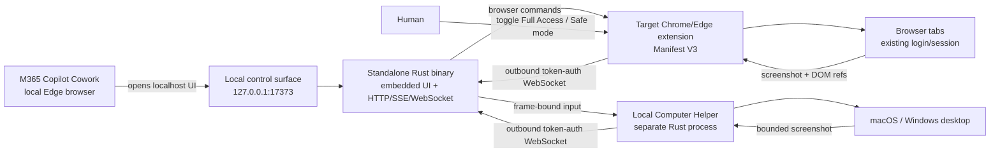

# Local Browser Bridge

Local Browser Bridge lets browser-only AI agents control real Chrome or Edge tabs—and, when the separate helper is running, the macOS or Windows desktop—through a `localhost` control surface. A local browser agent such as Microsoft 365 Copilot Cowork opens `http://127.0.0.1:17373`; the target Chromium extension and native computer helper connect outbound to the same Rust server.

This project does not copy any private OpenAI protocol. It independently implements publicly documented product behavior and established browser-extension patterns. See [docs/RESEARCH.md](docs/RESEARCH.md) for the research sources and feature comparison.

## Features

- List and switch tabs in a real, signed-in Chromium profile
- Navigate URLs, go back or forward, reload, create tabs, and close tabs
- Capture the current viewport, rendered text, selected text, and structured interactive-element references
- Click, fill, and select by element reference
- Click viewport coordinates, type into the focused control, and send arbitrary key chords
- Execute arbitrary JavaScript, including Promises, in the current page's main world
- **Full Access mode by default:** control all HTTP(S) sites, sensitive fields, risky clicks, and tab closing without approval
- Optional **Safe mode:** site allowlist, sensitive-field blocking, and popup approval for risky actions
- Control `file://` pages when Chrome's file-URL permission is enabled
- Redact URL query strings and fragments from returned tab metadata
- Loopback-only server, WebSocket token and extension-Origin validation, SameSite UI sessions, CSRF validation, CSP, and no CORS
- Accessible agent-facing DOM, activity log, and live SSE state updates
- Bearer-token REST command API and a Rust mock extension for testing
- Optional standalone Rust computer helper for macOS and Windows screen capture, frame-bound mouse input, Unicode text, and key chords
- Separate computer-process status and authority in the UI; no shell, filesystem, process-launch, clipboard, downloader, or telemetry command
- Standalone Rust binary with the entire control UI embedded; Node.js is not required
- Same-version Windows x86_64, macOS universal, and Chromium extension release assets
- Transparent GitHub-only update metadata check with no telemetry, download, or installation
- SHA-256 manifests, pinned release actions, GitHub build attestations, and immutable releases

## Architecture



The agent browser must run on the same computer, as Microsoft local browser does. Microsoft-hosted browsers and cloud browser tasks cannot reach the user's `127.0.0.1`, so they cannot use this bridge.

## Install and run

End users do not need Node.js or Rust. They only need the compiled executable and Chrome 116+, Edge 116+, or a compatible Chromium browser.

### Release download

Download the same release version for your platform plus the extension ZIP from [GitHub Releases](https://github.com/flrngel/local-browser-bridge/releases/latest). Desktop control is optional, but its helper must match the server version. The full verification and first-run flow is in [docs/INSTALL.md](docs/INSTALL.md).

Windows:

```powershell
.\local-browser-bridge-vVERSION-windows-x86_64.exe
.\local-computer-helper-vVERSION-windows-x86_64.exe
```

macOS Intel or Apple silicon:

```bash
tar -xzf local-browser-bridge-vVERSION-macos-universal.tar.gz
./local-browser-bridge
./Local\ Computer\ Helper.app/Contents/MacOS/local-computer-helper
```

The binary embeds all UI assets, so no web files or runtime installation are required. On Windows, the generated token is stored at `%USERPROFILE%\.local-browser-bridge\token`; on macOS it is stored at `~/.local-browser-bridge/token`.

### Build from source

Developer builds require Rust 1.88 or newer. End users still need no Rust toolchain.

```bash
cargo build --release
./target/release/local-browser-bridge
./target/release/local-computer-helper
```

The server prints:

```text
Control surface: http://127.0.0.1:17373
Extension token: <random token>
```

Load the extension in the target browser:

1. Open `chrome://extensions` in Chrome or `edge://extensions` in Edge.
2. Enable **Developer mode** and select **Load unpacked**.
3. Select the extracted extension ZIP folder containing `manifest.json` or this repository's `extension/` directory.
4. Open the extension popup and save the token printed by the server with port `17373`.
5. Confirm that **Full Access mode** is enabled. It is ON by default.
6. To control `file://` pages, also enable **Allow access to file URLs** in the extension details page.

For M365 Copilot Cowork running with the local Edge browser, use a prompt such as:

```text
Open http://127.0.0.1:17373 in the browser. Follow the Browser Bridge
instructions to observe the target tab and complete [the requested task].
Observe again after each action to verify the result. Use Direct browser
control for coordinate clicks, arbitrary key input, or JavaScript when needed.
If Local Computer Helper is connected, use the Native Computer observation for
other desktop applications and always act against its current frame ID.
```

Full Access executes sensitive actions immediately. Turning Full Access off restores Safe mode, where risky actions wait for **Approve once** or **Reject** in the extension popup. Pending approvals expire after two minutes.

## Local demo

Use two terminals to test the embedded UI and protocol without installing the real extension:

```bash
LBB_TOKEN=demo-token cargo run --release
```

```bash
LBB_TOKEN=demo-token cargo run --release --bin mock-extension
```

Open `http://127.0.0.1:17373` and select **Observe target**. The mock tab and element references will appear. The `/demo` route also contains a local form for testing the real extension.

On macOS or Windows, a third terminal can start `cargo run --release --bin local-computer-helper`. It shares the server token automatically. macOS will ask for Screen Recording when observing and Accessibility when input is first used.

## Environment variables

| Variable | Default | Purpose |
|---|---|---|
| `LBB_PORT` | `17373` | Loopback HTTP/WebSocket port |
| `LBB_TOKEN` | Generated automatically | Explicit bridge token |
| `LBB_TOKEN_PATH` | `~/.local-browser-bridge/token` | Generated-token storage path |
| `LBB_DISABLE_UPDATE_CHECK` | `false` | Disable the one-time GitHub release-metadata check |

The server always binds to `127.0.0.1` and rejects non-loopback Host headers.

## REST command API

Local clients can issue the same commands without using the browser UI:

```bash
curl http://127.0.0.1:17373/api/v1/command \
  -H "Authorization: Bearer $LBB_TOKEN" \
  -H "Content-Type: application/json" \
  --data '{"method":"tabs.list","params":{}}'
```

See [docs/PROTOCOL.md](docs/PROTOCOL.md) for the supported commands and WebSocket envelopes.

## Verification

```bash
cargo fmt --all -- --check
cargo clippy --all-targets -- -D warnings
cargo test --locked --all-targets
```

The test suite covers version alignment, exact extension permissions and package files, absence of remote extension code and updater APIs, command parity, token persistence, update metadata validation, command validation, CSRF and both WebSocket Origin boundaries, browser/computer relays, screenshot serving, frame freshness, and the helper's bounded capability contract.

## Deployment contract

In this repository, a user request to `deploy` means committing and pushing the intended version, publishing its immutable GitHub Release, then downloading and verifying all of the following in `dist/`:

- A Node.js-free Windows x86_64 server `.exe`
- A separate Node.js-free Windows x86_64 computer-helper `.exe`
- A Node.js-free macOS universal archive containing the server and permission-owning helper `.app`, both `arm64` and `x86_64`
- A matching-version Chromium extension ZIP
- `SHA256SUMS.txt` for all four artifacts
- GitHub build provenance and release integrity verification

The canonical build is `.github/workflows/deploy.yml`, triggered by a matching `vVERSION` tag. `scripts/deploy.sh` provides the same local build on a macOS host with `cargo-xwin`. A completed deployment must return the public release link and direct local paths to every downloaded, reverified artifact.

## Limitations

- Native desktop v0.6 is pixel-first. It does not yet return macOS AX or Windows UIA element trees, focus applications by semantic identity, preserve the user's real cursor, or draw a separate agent cursor.
- Chromium does not allow control of `chrome://`, `edge://`, extension pages, or browser permission UI through this extension.
- File-page control requires the user to enable Chrome's file-URL permission for the extension.
- Element references expire when the page structure changes. Observe again before reusing them.
- Reference clicks use trusted Chrome DevTools Protocol input when possible and detach immediately. If DevTools is already attached, the extension falls back to a synthetic click and returns `trusted: false`.
- Full Access can enter passwords, payment data, and OTPs and can execute page JavaScript. Treat it as remote-control authority over the signed-in browser profile.
- Unpacked extensions are intended for development or personal installation. Organization-wide deployment requires signing, policy review, and privacy disclosures.
- Windows artifacts are not yet publisher-signed, and macOS artifacts are not yet Developer ID-signed or notarized. SmartScreen or Gatekeeper may warn. See [docs/INSTALL.md](docs/INSTALL.md) before overriding a per-app warning; never disable platform protection globally.

See [SECURITY.md](SECURITY.md) for the security model and trust boundaries.
