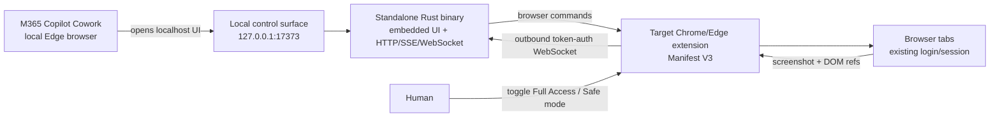

# Local Browser Bridge

브라우저 도구만 가진 AI 에이전트가 `localhost` 제어판을 통해 실제 Chrome/Edge 탭을 읽고 조작하도록 연결하는 로컬 브리지입니다. Microsoft 365 Copilot Cowork처럼 **이 컴퓨터에서 실행되는 브라우저 자동화**가 `http://127.0.0.1:17373`을 열고, 대상 Chromium 확장은 outbound WebSocket으로 같은 서버에 연결합니다.

이 프로젝트는 OpenAI 내부 프로토콜을 복제하지 않습니다. 공식 문서에서 확인한 사용자 경험과 공개된 확장 플랫폼 패턴을 독립적으로 구현합니다. 조사 근거와 기능 비교는 [docs/RESEARCH.md](docs/RESEARCH.md)에 정리했습니다.

## 구현된 기능

- 로그인된 실제 Chromium 프로필의 탭 목록과 탭 전환
- URL 이동, 뒤로/앞으로, 새로고침, 새 탭
- 현재 뷰포트 스크린샷, 렌더링 텍스트, 선택 텍스트, 구조화된 interactive element refs
- ref 기반 클릭/입력/선택과 좌표 클릭, focused-control 텍스트 입력, 자유 키 조합
- 현재 페이지 main world에서 Promise를 포함한 임의 JavaScript 실행
- 기본값인 **Full Access mode**: 모든 HTTP(S) 사이트, 민감 필드, 위험 클릭, 탭 닫기를 승인 없이 실행
- 선택 가능한 **Safe mode**: 사이트 allowlist, 민감 필드 차단, 위험 동작 popup approval
- URL query/fragment 비공개 처리와 `file://` 제어 지원
- loopback-only 서버, WebSocket token + extension Origin 검증, UI SameSite session + CSRF, CSP, no CORS
- 브라우저 에이전트 친화적인 접근성 DOM, 감사 로그, SSE 상태 갱신
- bearer-token REST 명령 API와 테스트용 mock extension

## 구조



중요한 네트워크 조건: Microsoft의 **local browser**처럼 에이전트 브라우저가 같은 PC에서 돌아야 합니다. Microsoft-hosted browser, Copilot Tasks cloud browser 등은 사용자 PC의 `127.0.0.1`에 접근할 수 없으므로 이 방식이 작동하지 않습니다.

## 설치와 실행

실행 파일을 사용하는 최종 사용자에게 Node.js나 Rust는 필요하지 않습니다. Chrome 116+ 또는 호환 Edge만 있으면 됩니다.

### Windows 실행 파일

배포 산출물의 `local-browser-bridge-vX.Y.Z-windows-x86_64.exe`를 실행합니다.

```powershell
.\local-browser-bridge-v0.3.0-windows-x86_64.exe
```

서버는 UI를 실행 파일 안에 내장하고 있어 별도의 웹 파일이나 런타임을 설치하지 않습니다. Windows에서 생성 token은 기본적으로 `%USERPROFILE%\.local-browser-bridge\token`에 보관됩니다.

### 소스에서 빌드

개발자 빌드에는 Rust 1.85+가 필요합니다.

```bash
cargo build --release
./target/release/local-browser-bridge
```

서버는 다음 정보를 출력합니다.

```text
Control surface: http://127.0.0.1:17373
Extension token: <random token>
```

그다음 대상 브라우저에 확장을 로드합니다.

1. Chrome에서 `chrome://extensions`를 엽니다. Edge라면 `edge://extensions`를 엽니다.
2. Developer mode를 켜고 **Load unpacked**를 선택합니다.
3. 배포된 extension ZIP을 푼 폴더 또는 이 저장소의 `extension/` 폴더를 선택합니다.
4. 확장 팝업을 열고 서버가 출력한 token과 포트 `17373`을 저장합니다.
5. 확장 팝업에서 **Full Access mode**가 켜졌는지 확인합니다. 기본값은 ON입니다. `file://` 페이지까지 조작하려면 확장 상세 화면에서 **Allow access to file URLs**도 켭니다.

M365 Copilot Cowork에서는 local browser가 활성화된 Edge에서 다음처럼 요청할 수 있습니다.

```text
브라우저로 http://127.0.0.1:17373 을 열어. Browser Bridge의 지침에 따라
대상 탭을 관찰하고, [원하는 작업]을 수행해. 각 액션 뒤에는 다시 관찰해서
결과를 확인해. 필요하면 Direct browser control에서 좌표 클릭, 자유 키 입력,
JavaScript 실행도 사용해.
```

Full Access mode에서는 민감한 액션도 즉시 실행됩니다. 확장 팝업에서 Full Access를 끄면 Safe mode로 전환되고, 위험 액션은 **Approve once** 또는 **Reject**를 기다리며 승인은 2분 후 만료됩니다.

## 빠른 로컬 데모

실제 확장을 설치하기 전에 UI와 통신만 확인할 수 있습니다. 터미널 두 개를 사용합니다.

```bash
LBB_TOKEN=demo-token cargo run --release
```

```bash
LBB_TOKEN=demo-token cargo run --release --bin mock-extension
```

`http://127.0.0.1:17373`을 열고 **Observe target**을 누르면 mock tab과 element refs가 표시됩니다. `/demo`에는 실제 확장 동작을 확인할 안전한 로컬 폼도 포함되어 있습니다.

## 환경 변수

| 변수 | 기본값 | 의미 |
|---|---|---|
| `LBB_PORT` | `17373` | loopback HTTP/WebSocket 포트 |
| `LBB_TOKEN` | 자동 생성 | 명시적 bridge token |
| `LBB_TOKEN_PATH` | `~/.local-browser-bridge/token` | 생성 token 저장 위치 |

서버는 코드상 `127.0.0.1`에만 bind하며 외부 인터페이스 bind를 거부합니다.

## REST 명령 API

브라우저 UI 이외의 로컬 클라이언트도 같은 명령을 사용할 수 있습니다.

```bash
curl http://127.0.0.1:17373/api/v1/command \
  -H "Authorization: Bearer $LBB_TOKEN" \
  -H "Content-Type: application/json" \
  --data '{"method":"tabs.list","params":{}}'
```

지원 명령과 WebSocket envelope는 [docs/PROTOCOL.md](docs/PROTOCOL.md)에 있습니다.

## 검증

```bash
cargo fmt --all -- --check
cargo clippy --all-targets -- -D warnings
cargo test --locked --all-targets
```

검증 범위는 syntax, version alignment, Full Access/Safe mode URL 경계, URL redaction, risky-action 분류, command validation, CSRF/Origin 방어, WebSocket Origin 방어, command relay, screenshot 저장을 포함합니다.

## 배포 규칙

이 저장소에서 사용자가 `deploy` 또는 `배포`라고 요청하면 다음 산출물을 `dist/`에 생성하고 검증합니다.

- Node.js 없이 실행되는 Windows x86_64 `.exe`
- 같은 버전의 Chromium extension ZIP
- 두 파일의 `SHA256SUMS.txt`

Windows에서는 `scripts/deploy.sh`를 바로 사용할 수 있고, macOS/Linux에서는 `cargo-xwin` 또는 MinGW cross-compiler가 필요합니다. `.github/workflows/deploy.yml`도 동일한 Windows 산출물을 생성합니다. 배포가 끝나면 산출물 경로를 사용자에게 직접 제공합니다.

## 제한사항

- 이것은 브라우저 computer-use bridge입니다. macOS/Windows의 다른 데스크톱 앱을 조작하는 native accessibility helper는 포함하지 않습니다.
- `chrome://`, `edge://`, 다른 확장 페이지, 브라우저 permission UI는 Chromium 정책상 조작하지 않습니다.
- `file://`은 브라우저 확장 상세 설정에서 파일 URL 접근을 별도로 허용해야 합니다.
- 사이트 구조가 바뀌면 ref가 만료됩니다. 반드시 다시 Observe한 뒤 새 ref를 사용해야 합니다.
- 클릭은 가능하면 Chrome DevTools Protocol의 trusted input을 사용하고 즉시 detach합니다. DevTools가 이미 해당 탭에 붙어 있으면 synthetic click으로 fallback하며 결과에 `trusted: false`가 표시됩니다.
- Full Access는 비밀번호·카드·OTP를 입력할 수 있고 page JavaScript를 실행할 수 있습니다. 이 기능을 켠 상태에서는 이 브리지를 로그인된 브라우저의 원격 제어 권한과 동일하게 취급하십시오.
- unpacked extension은 개발/개인 설치용입니다. 조직 배포에는 서명, 정책 검토, privacy disclosure가 별도로 필요합니다.
- 현재 Windows 실행 파일은 코드 서명이 자동 적용되지 않으므로 SmartScreen 경고가 표시될 수 있습니다.

보안 모델과 위협 경계는 [SECURITY.md](SECURITY.md)를 확인하세요.
