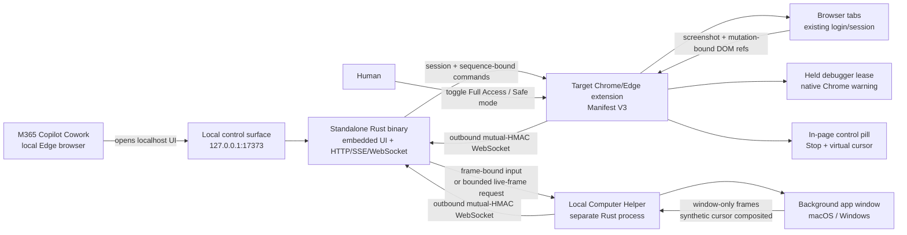

# Local Browser Bridge

Local Browser Bridge lets browser-only AI agents control real Chrome or Edge tabs—and, when the separate helper is running, selected macOS or Windows application windows—through a `localhost` control surface. A local browser agent such as Microsoft 365 Copilot Cowork opens `http://127.0.0.1:17373`; the target Chromium extension and native computer helper connect outbound to the same Rust server.

This project does not copy any private OpenAI protocol. It independently implements publicly documented product behavior and established browser-extension patterns. See [docs/RESEARCH.md](docs/RESEARCH.md) for the original extension comparison and [docs/COMPUTER_USE_RESEARCH.md](docs/COMPUTER_USE_RESEARCH.md) for the pinned version 0.9 browser-control and computer-use review.

## Features

- List and switch tabs in a real, signed-in Chromium profile
- Navigate URLs, go back or forward, reload, create tabs, and close tabs
- Capture the current viewport, rendered text, selected text, and structured interactive-element references
- Click, fill, and select by element reference
- Merge cross-origin iframe elements into the same observation, with top-level coordinates, frame provenance, and `<generation>.f2.e5` refs that `page.click` and `page.hover` accept
- Hover elements and send right/middle, multi-click, and Shift/Control/Alt/Meta-modified clicks
- Click viewport coordinates, type into the focused control, and send arbitrary key chords
- Accept both `Meta+L` and `ctrl+shift+t` key-chord dialects, normalized server-side for browser and desktop keys
- Execute arbitrary JavaScript, including Promises, in the current page's main world
- Wait for page conditions—text appearing or disappearing, a URL prefix, or DOM quiescence—instead of polling observations
- Run up to ten epoch-bound click/fill/select/key/scroll actions as one batch that stops at the first failure
- Intercept JavaScript dialogs: renderer-touching commands fail fast while a dialog is pending—without revoking the control lease, even when the dialog opens mid-action or inside the handler of the element just clicked—until `page.handleDialog` accepts or dismisses it
- Address browser and desktop frames with `normalized1000` coordinates converted server-side against the exact observed frame
- Hold one explicit, expiring browser-control lease on one tab, with `sessionId`, observation `turn`, and pointer `moveSequence` bindings
- Keep Chrome's native **Local Browser Bridge started debugging this browser** warning visible for the full trusted-control lease
- Show a separate in-page **Local Browser Bridge is using this tab** pill, trusted **Stop** button, and model-visible synthetic cursor
- Put tabs created by the bridge in a named **Local Browser Bridge** Chrome tab group
- **Full Access mode by default:** control all HTTP(S) sites, sensitive fields, risky clicks, and tab closing without approval
- Optional **Safe mode:** site allowlist, sensitive-field blocking, and popup approval for risky actions
- Control `file://` pages when Chrome's file-URL permission is enabled
- Redact URL query strings and fragments from returned tab metadata
- Loopback-only server, token-authenticated dashboard/read APIs, token-free mutual-HMAC connector WebSockets, exact connector-Origin validation, expiring port-origin dashboard sessions, CSRF validation, CSP, and no CORS
- Strict Host-header validation on every HTTP and WebSocket endpoint as a DNS-rebinding defense
- Versioned connector handshakes, per-connection session IDs, monotonic command/event sequences, bounded outbound queues, and exact package-version compatibility checks
- Accessible agent-facing DOM, activity log, and live SSE state updates
- Bearer-token REST command API and a Rust mock extension for testing
- Idempotent commands: an optional `callId` deduplicates in-flight calls and replays completed results verbatim
- Structured error taxonomy with retriability and a recovery hint on every failed API response
- Optional standalone Rust computer helper for macOS and Windows exact-window capture, background-routed mouse input, Unicode text, and key chords
- Optional exact-window live frame feed at 1–10 FPS, with a session-owned synthetic pointer composited into observations and shared frames
- Ack-paced latest-frame-wins share delivery with an honest dropped-frame counter when server and helper both negotiate it
- Non-interrupting computer-use contract: no global HID input, hardware-cursor movement, user-focus loss, target-app activation, desktop switching, or implicit foreground fallback
- Separate computer-process status and authority in the UI; no shell, filesystem, process-launch, clipboard, downloader, or telemetry command
- Standalone Rust binary with the entire control UI embedded; Node.js is not required
- Same-version Windows x86_64, macOS universal, and Chromium extension release assets
- Semantic-first macOS Accessibility and Windows UI Automation actions with screenshot-bound refs and postcondition reporting
- Transparent GitHub-only update metadata check with no telemetry, download, or installation
- SHA-256 manifests, pinned release actions, GitHub build attestations, and immutable releases

## Architecture



The agent browser must run on the same computer, as Microsoft local browser does. Microsoft-hosted browsers and cloud browser tasks cannot reach the user's `127.0.0.1`, so they cannot use this bridge.

## Install and run

End users do not need Node.js or Rust. They only need the compiled executable and Chrome 116+, Edge 116+, or a compatible Chromium browser.

### Release download

Download the same release version for your platform plus the extension ZIP from [GitHub Releases](https://github.com/flrngel/local-browser-bridge/releases/latest). Desktop control is optional, but its helper must match the server version. The full verification and first-run flow is in [docs/INSTALL.md](docs/INSTALL.md).

Windows:

```powershell
.\local-browser-bridge-vVERSION-windows-x86_64.exe
.\local-computer-helper-vVERSION-windows-x86_64.exe
```

macOS Intel or Apple silicon:

```bash
tar -xzf local-browser-bridge-vVERSION-macos-universal.tar.gz
./local-browser-bridge
./Local\ Computer\ Helper.app/Contents/MacOS/local-computer-helper
```

The binary embeds all UI assets, so no web files or runtime installation are required. On Windows, the generated token is stored at `%USERPROFILE%\.local-browser-bridge\token`; on macOS it is stored at `~/.local-browser-bridge/token`.

### Build from source

Developer builds require Rust 1.88 or newer. End users still need no Rust toolchain.

```bash
cargo build --release
./target/release/local-browser-bridge
./target/release/local-computer-helper
```

The server prints:

```text
Control surface: http://127.0.0.1:17373/#token=<random token>
Extension token: <random token>
```

Open the complete control-surface URL printed by the server. The master token stays in the URL fragment, is removed from browser history immediately, and is exchanged once for an expiring random dashboard capability kept in this exact origin's `sessionStorage`. It is not a localhost cookie, so unrelated services on other ports do not receive it. If you open the bare URL without an existing session, the dashboard asks you to paste the master token. State, event, and screenshot endpoints reject unauthenticated local clients.

Load the extension in the target browser:

1. Open `chrome://extensions` in Chrome or `edge://extensions` in Edge.
2. Enable **Developer mode** and select **Load unpacked**.
3. Select the extracted extension ZIP folder containing `manifest.json` or this repository's `extension/` directory.
4. Open the extension popup and save the token printed by the server with port `17373`.
5. Confirm that **Full Access mode** is enabled. It is ON by default.
6. To control `file://` pages, also enable **Allow access to file URLs** in the extension details page.

When trusted control starts, Chrome itself displays **Local Browser Bridge started debugging this browser**. The controlled page separately displays **Local Browser Bridge is using this tab** with a **Stop** button. They are intentionally independent: Chrome owns the first warning and the extension owns the second. Choosing Chrome's Cancel action, the in-page Stop button, **Release control** in the extension popup, lease expiry, tab closure, or bridge disconnection revokes the lease. Chrome Cancel and either human Stop control also persist a global pause across browser and service-worker restarts: remote commands cannot resume on any tab until a person selects **Resume** in the extension popup and then starts a new lease. The extension never falls back to an untrusted DOM click.

For M365 Copilot Cowork running with the local Edge browser, use a prompt such as:

```text
Open the complete authenticated Control surface URL printed by Local Browser
Bridge. Follow the Browser Bridge
instructions to observe the target tab and complete [the requested task].
Start a visible browser control session for the target tab. Observe again after
each action to verify the result and use the current session, turn, generation,
and move sequence. Use Direct browser control for coordinate clicks, arbitrary
key input, or JavaScript when needed. If Local Computer Helper is connected,
use the Native Computer observation for other desktop applications, always act
against its current frame ID, and start an exact-window share only when a live
preview is useful. Stop both control sessions when the task is complete.
```

Full Access executes sensitive actions immediately. Turning Full Access off restores Safe mode, where risky actions wait for **Approve once** or **Reject** in the extension popup. Pending approvals expire after two minutes.

## Local demo

Use two terminals to test the embedded UI and protocol without installing the real extension:

```bash
cargo run --release
```

```bash
cargo run --release --bin mock-extension
```

Open the complete authenticated URL printed by the server and select **Observe target**. Both processes read the same generated token file automatically. The mock tab and element references will appear. The `/demo` route also contains a local form for testing the real extension.

On macOS or Windows, a third terminal can start `cargo run --release --bin local-computer-helper`. It shares the server token automatically. Choose a target application window in the control page, then observe it. macOS will ask for Screen Recording when observing and Accessibility when input is first used.

## Environment variables

| Variable | Default | Purpose |
|---|---|---|
| `LBB_PORT` | `17373` | Loopback HTTP/WebSocket port |
| `LBB_TOKEN` | Generated automatically | Explicit bridge token |
| `LBB_TOKEN_PATH` | `~/.local-browser-bridge/token` | Generated-token storage path |
| `LBB_DISABLE_UPDATE_CHECK` | `false` | Disable the one-time GitHub release-metadata check |

The server always binds to `127.0.0.1` and rejects non-loopback Host headers.

## REST command API

Local clients can issue the same commands without using the browser UI:

```bash
curl http://127.0.0.1:17373/api/v1/command \
  -H "Authorization: Bearer $LBB_TOKEN" \
  -H "Content-Type: application/json" \
  --data '{"method":"tabs.list","params":{}}'
```

See [docs/PROTOCOL.md](docs/PROTOCOL.md) for the supported commands and WebSocket envelopes.

## Verification

```bash
cargo fmt --all -- --check
cargo clippy --all-targets -- -D warnings
cargo test --locked --all-targets
```

The test suite covers version alignment, exact extension permissions and package files, absence of remote extension code and updater APIs, command parity, token persistence, update metadata validation, command validation, CSRF and both WebSocket Origin boundaries, protocol/session mismatch rejection, browser/computer relays, screenshot serving, frame freshness, debugger-revocation contracts, the cross-origin frame ref grammar, coordinate translation, and budget arithmetic, the dialog gate's non-revocation boundaries, and the helper's bounded capability contract. The implementation review and release-specific evidence index are in [docs/SOTA_AUDIT.md](docs/SOTA_AUDIT.md).

## Deployment contract

In this repository, a user request to `deploy` means committing and pushing the intended version, publishing its immutable GitHub Release, then downloading and verifying all of the following in `dist/`:

- A Node.js-free Windows x86_64 server `.exe`
- A separate Node.js-free Windows x86_64 computer-helper `.exe`
- A Node.js-free macOS universal archive containing the server and permission-owning helper `.app`, both `arm64` and `x86_64`
- A matching-version Chromium extension ZIP
- `SHA256SUMS.txt` for all four artifacts
- GitHub build provenance and release integrity verification

The canonical build is `.github/workflows/deploy.yml`, triggered by a matching `vVERSION` tag. `scripts/deploy.sh` provides the same local build on a macOS host with `cargo-xwin`. A completed deployment must return the public release link and direct local paths to every downloaded, reverified artifact.

## Limitations

- Native computer control is hybrid and exact-window scoped: frame-bound macOS Accessibility or Windows UI Automation refs are preferred for supported controls, with background pixel input available for visual targets. Unsupported delivery fails closed; the helper never escalates to foreground input automatically.
- The helper's exact-window live feed is repeated, bounded capture from one selected window. It is not an OS screen-sharing session, virtual display, remote desktop, VM, or separate input seat. It preserves the foreground and hardware cursor but does not isolate untrusted work from the user's login session.
- The helper pointer is synthetic state composited into returned exact-window images. Version 0.11 does not install a native click-through desktop cursor overlay, and the hardware cursor never represents agent state.
- macOS pixel input relies on dynamically resolved, undocumented SkyLight symbols and is limited to non-minimized windows on the active Space. Windows uses UI Automation plus exact-HWND background messages. Elevated, game, secure-input, protected-content, and custom-rendered surfaces can still refuse control.
- Chromium does not allow control of `chrome://`, `edge://`, extension pages, or browser permission UI through this extension.
- File-page control requires the user to enable Chrome's file-URL permission for the extension.
- Element references expire when the page structure changes. Observe again before reusing them.
- Open shadow roots are included in browser observations, and cross-origin iframe elements are merged into the same observation with top-level coordinates and `<generation>.f2.e5` refs that `page.click` and `page.hover` accept; every unmerged frame is reported in `frameSummary.skipped`. Same-process iframes and frame-scoped fill/select/key/scroll/typeText are still deferred, and cross-origin merging itself is proven only by the contract suites until a live-Chrome run is recorded (see `docs/PROTOCOL.md`).
- A pending JavaScript dialog blocks renderer-touching commands but no longer revokes the lease: version 0.10 shipped this gate and a live run proved it was still defeated by an in-flight observation (see [evidence/v0.10.0/README.md](evidence/v0.10.0/README.md)), and version 0.11 closes that path. An explicit stop, a human pause, the lease TTL, and any failure seen with no dialog pending still revoke.
- Trusted browser control holds one `chrome.debugger` attachment for the lease. Chrome therefore keeps its native warning visible, and another debugger cannot attach to that tab at the same time. There is no DOM `.click()` fallback: debugger loss or user cancellation revokes authority and the pending action fails closed.
- One extension-controlled tab lease is active at a time. Switching the controlled target ends the old lease before attaching to the new tab.
- The Chrome warning, page control pill, and helper pointer are different surfaces. The warning is browser chrome, the pill/cursor are page content, and the helper pointer exists only in returned exact-window frames.
- Full Access can enter passwords, payment data, and OTPs and can execute page JavaScript. Treat it as remote-control authority over the signed-in browser profile.
- Unpacked extensions are intended for development or personal installation. Organization-wide deployment requires signing, policy review, and privacy disclosures.
- Windows artifacts are not yet publisher-signed, and macOS artifacts are not yet Developer ID-signed or notarized. SmartScreen or Gatekeeper may warn. See [docs/INSTALL.md](docs/INSTALL.md) before overriding a per-app warning; never disable platform protection globally.

See [SECURITY.md](SECURITY.md) for the security model and trust boundaries.
